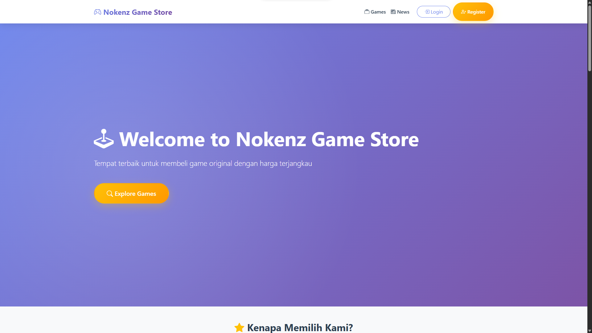
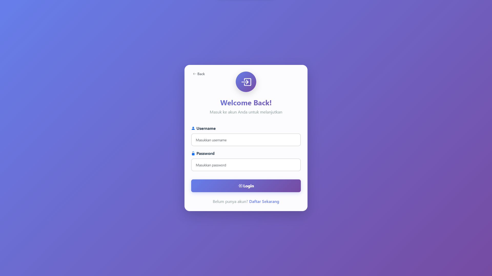
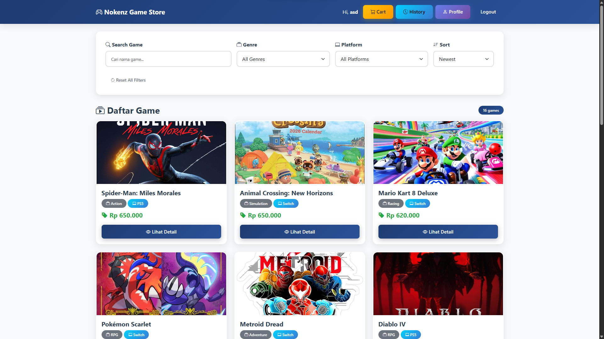
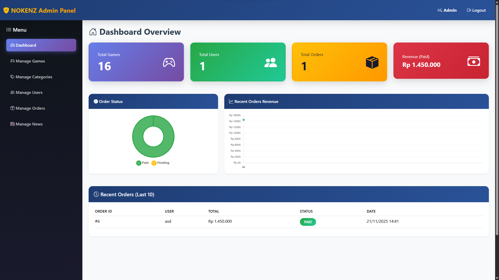
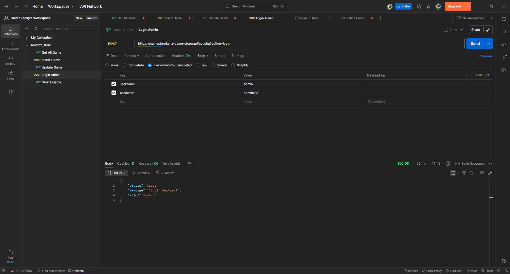
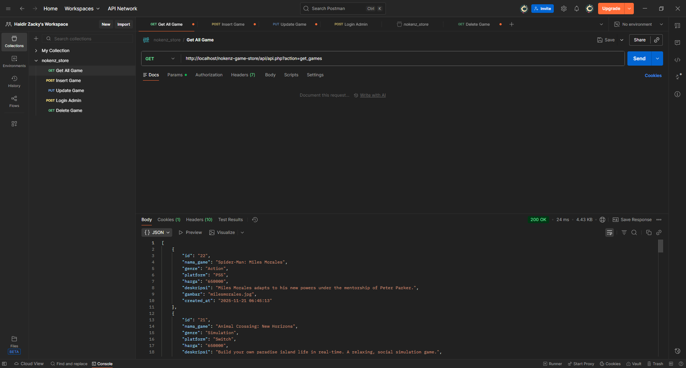
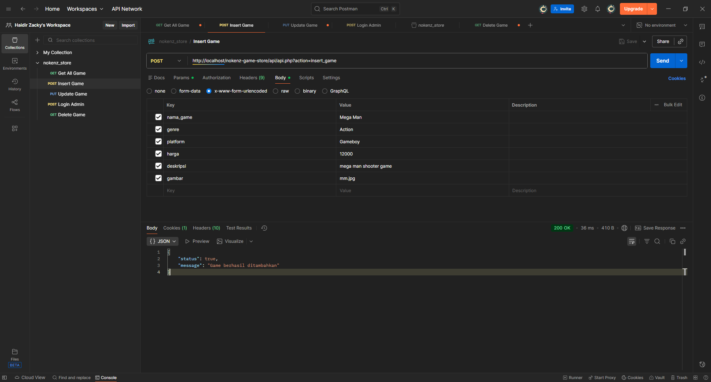
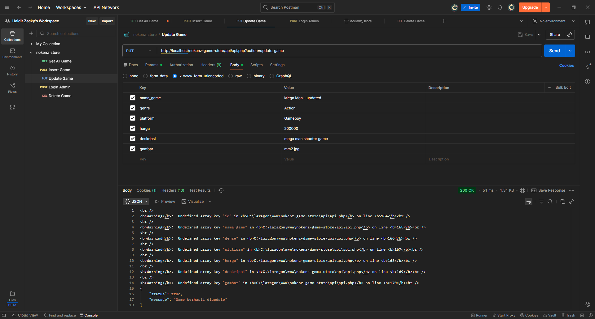
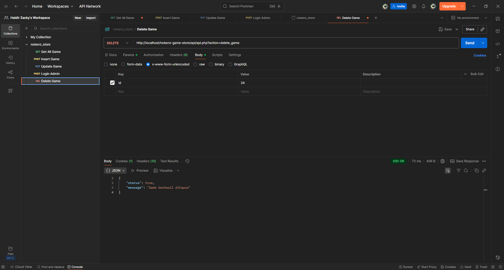

# 🎮 Nokenz Game Store - UTS Pemrograman Web 1

Proyek ini merupakan implementasi dari **Ujian Tengah Semester -
Pemrograman Web 1 (3 SKS)** di **Universitas Teknologi Bandung (UTB)**.

-   **Dosen Pengampu:** Nova Agustina, S.T., M.Kom
-   **Kelas:** TIF RP 23 CNS B
-   **Mahasiswa:** 23552011072 - Haidir Mirza Ahmad Zacky

------------------------------------------------------------------------

## 🚀 Teknologi yang Digunakan

  -----------------------------------------------------------------------
  Kategori            Teknologi                Keterangan
  ------------------- ------------------------ --------------------------
  **Frontend**        HTML5, CSS3, JavaScript  Tampilan dan interaksi
                                               Website

  **CSS Framework**   Bootstrap 5              Untuk tampilan UI
                                               responsif

  **Backend**         PHP Native               Mengelola logika API

  **Database**        MySQL / MariaDB          Penyimpanan Data

  **API Testing**     Postman / Bruno          Uji semua endpoint API

  **Local Server**    Laragon                  Menjalankan PHP & Database
  -----------------------------------------------------------------------

------------------------------------------------------------------------

## 💻 Project 1 - Website "Nokenz Game Store"

Website dibangun menggunakan HTML, CSS, JavaScript, dan Bootstrap 5.
Semua data diambil dari API.

### 🔑 Fitur Website

-   Halaman Home
-   Halaman Detail (Game & Berita)
-   Login dengan Validasi JavaScript
-   Registrasi
-   Dashboard User
-   Footer wajib pada semua halaman

------------------------------------------------------------------------

## 🛠️ Project 2 - CRUD API (PHP Native)

Semua endpoint berada pada file:

    api/api.php

Menggunakan parameter:

    ?action=<nama_action>

### Endpoints Utama

-   **Autentikasi**: register, login, logout\
-   **Public Data**: get_games, get_game, get_news, get_genres,
    get_platforms\
-   **CRUD Game (Admin)**: insert_game, update_game, delete_game\
-   **Cart & Order (User)**: add_cart, get_cart, checkout,
    order_history, payment_confirm

------------------------------------------------------------------------

## 📸 Screenshot Proyek

### **I. Website**

#### 🏠 **Landing Page**  

#### 🔐 **Login**  

#### 🏠 **Home**  

  
#### 🧑‍💼 **Dashboard**  

---

### **II. API Testing (Postman / Bruno)**

#### 🔑 **Login Admin**  

#### 🎮 **Get All Game**  

#### ➕ **Insert Game**  

#### ✏️ **Update Game**  

#### ❌ **Delete Game**  

------------------------------------------------------------------------
